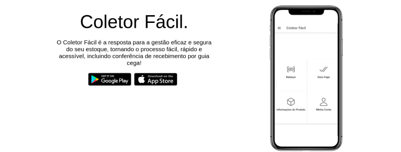

##

### Hi there 👋

A little about me:

- 🇧🇷   Salvador-BA, **Brazil**.
- 🔭   I’m currently working with **Angular** and **Ionic Framework**.
- 🌱   I’m currently learning things related to **Angular** and **Nest.js**.
-  I have an app on [Google Play](https://play.google.com/store/apps/details?id=com.aasoftware.coletorfacil)
- 📚   Self-taugh
- ⚡   Fun fact: Solving Rubik's cubes is a great way to relax and de-stress. 🤓
 

### 🏆 Trophy

### 📈 Stats 

  

### 💡  Languages 

### ⚡ Skills:

 

### 📫 Social Media:

